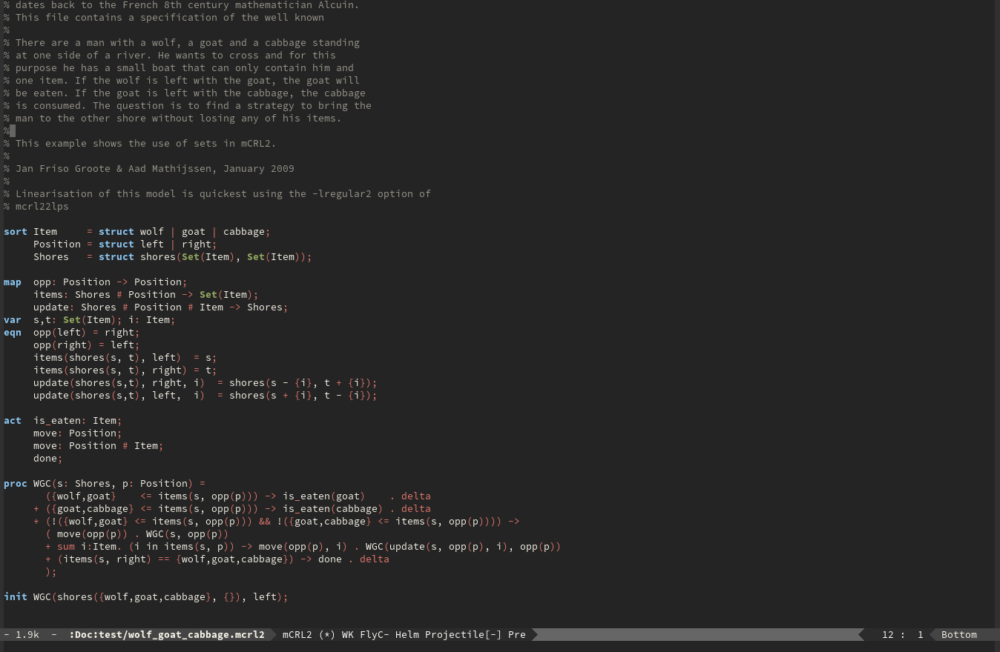

# mCRL2 mode

This is a major mode to edit and analyse mCRL2 specifications using the mCRL2 toolset. The mCRL2 tools are executed using the interface of the excelent transient package.

The idea is to give the same functionality as mCRL2 IDE and parts of mCRL2 GUI.

The output will be written in to the buffer `*mCRL2 Tools Output` and the output files will be written in the folder `artifacts`.

## Installation

The usual Emacs way.

## Usage

Bring up the transient menu using `M-x mcrl2-tools` command or by executing `C-c C-t`.
Execute a quick syntax check using `C-c C-c`.

## Contributing
Pull requests or tips/remarks are welcome!

## Acknowlements
 - Magit Transient
